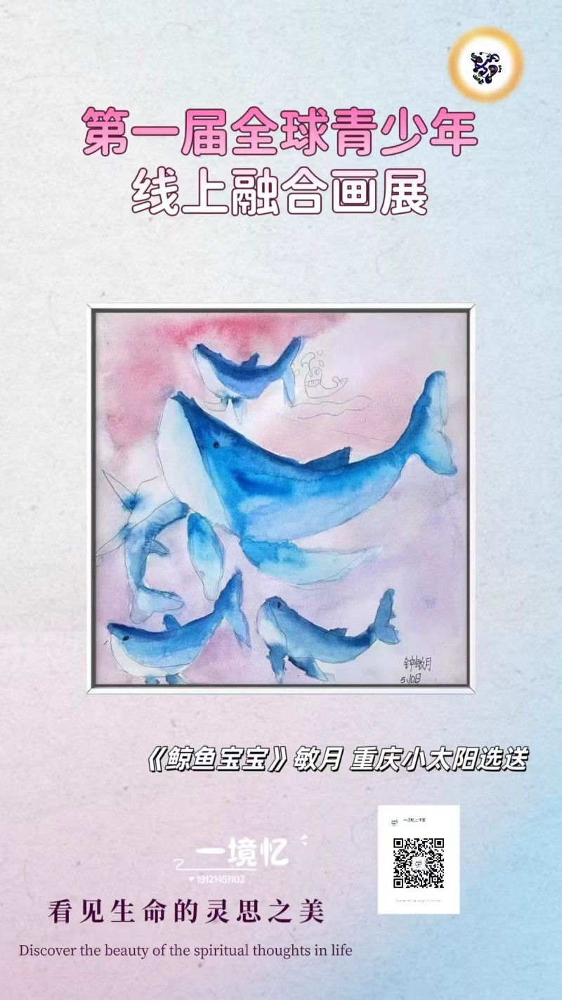

## Background

I'm helping a Hackathon mentor redesign a page for HUcares (hucares.com.hk), specifically the art exhibition page at Product1.aspx?TypeID=15. 

### Current State
The existing site is built on ASP.NET WebForms (.NET 4.0) — visually dated, server errors on several pages (Voluntarists.aspx, InfoHub.aspx throw NullReferenceExceptions). The art exhibition page displays children's artwork from "一境忆" (Yijingyi), a Shanghai-based inclusive education organization for special needs children. 

### Content to Preserve
- **Organization**: 一境忆艺术工作室 (Yijingyi Art Studio), founded 2020, focuses on inclusive rehabilitation for special needs children (autism, rare diseases), using art therapy, music therapy, physical therapy, equestrian therapy, etc. ACMT system. Team of 7.
- **Exhibition**: 全球首届青少年线上融合画展 (First Global Youth Online Inclusive Art Exhibition)
- **Artworks** (6 pieces, all priced ¥1 symbolically):
  1. 鲸鱼宝宝 (Baby Whale) - https://hucares.com.hk/upload/20250604170157.jpg
  2. 声音的奔跑 (Running Sound) - https://hucares.com.hk/upload/20250604165707.jpg
  3. 飞之眷 (Wings of Love) - https://hucares.com.hk/upload/20250604165303.jpg
  4. 星怪 (Star Monster) - https://hucares.com.hk/upload/20250604164751.jpg
  5. 猫 (Cat) - https://hucares.com.hk/upload/20250603195132.jpg
  6. 爱 (Love) - https://hucares.com.hk/upload/20250603194644.jpg
- **Mission phrases**: 
  - "看见生命的灵思之美" (See the beauty of life's spiritual inspiration)
  - "美来自人类与生俱来的情感和感受力" 
  - "在孩子的画作中蕴藏着生命的灵思之美"
  - "这灵思之美将创造不一样的世界"
- **Brand values**: 自由、包容、公正、共生 (Liberty, Inclusiveness, Equity, Coexistence)
- **Parent brand**: HUcares - "让技能者被看见、获尊重、动天下"
- **Contact**: HCer@hucares.work
- **Social**: TikTok, 小红书 (Xiaohongshu)

### Requirements
1. **Tech stack**: Pure HTML/CSS/JS — single index.html file (Hackathon-friendly, no build tools)
2. **Images**: Will be downloaded locally to the project
3. **Scope**: Only the art exhibition page — immersive single-page gallery experience
4. **Design style**: Apple-inspired — minimalist, artistic, generous white space, clean typography, subtle animations, large imagery, scroll-driven storytelling

### Design Vision — Apple-Inspired Art Gallery
Think of how Apple presents their products: 
- Hero section with bold typography and emotional messaging
- Scroll-driven narrative that unfolds section by section
- Each artwork gets its own "stage" — full-viewport or near-full-viewport presentation
- Minimal UI chrome, maximum visual impact
- Smooth scroll animations (parallax, fade-in, scale transitions)
- Dark/light contrast sections for dramatic effect
- Chinese + English bilingual typography hierarchy

Please design a detailed implementation plan for this single-page immersive art exhibition, covering:
1. Page structure/sections breakdown
2. Visual design approach (typography, colors, spacing, dark/light sections)
3. Animation/interaction strategy (scroll-triggered, CSS-only vs lightweight JS)
4. Responsive design approach (mobile-first)
5. File/folder structure
6. Specific CSS/JS techniques to achieve the Apple feel
7. Accessibility considerations for an art exhibition about inclusivity


=================

<task-notification>
<task-id>a7f237f</task-id>
<status>completed</status>
<summary>Agent "Design Apple-style art exhibition page" completed</summary>
<result>Now I have all the information needed. Let me create the comprehensive implementation plan.

---

# 🎨 HUcares Art Exhibition — Implementation Plan

## Apple-Inspired Immersive Single-Page Gallery for 一境忆 (Yijingyi)

---

## 1. Page Structure / Sections Breakdown

The page unfolds as a **scroll-driven narrative** — each section occupies near-full viewport height, telling the story from mission → artworks → call to action.

### Section Map (top to bottom):

| # | Section | Height | BG Mode | Purpose |
|---|---------|--------|---------|---------|
| 1 | **Hero / Title** | 100vh | Dark (near-black) | Dramatic opening. Exhibition title, date, a single evocative tagline. Subtle downward-scroll indicator. |
| 2 | **Mission / Philosophy** | 100vh | Light (warm white) | "看见生命的灵思之美" — the three belief statements fade in sequentially on scroll. Bilingual. |
| 3 | **About Yijingyi** | ~80vh | Light | Brief org intro — founded 2020, Shanghai, ACMT system. Soft background texture. |
| 4–9 | **Artwork Stages** (×6) | 100vh each | Alternating Dark/Light | Each artwork gets its own "stage" — full-bleed image, title, symbolic ¥1 price badge. Apple-style "one thing per screen" presentation. |
| 10 | **Exhibition Context** | 80vh | Dark | "全球首届青少年线上融合画展" — expected outcomes, emotional closing paragraph. |
| 11 | **Values & Brand** | 60vh | Light | Four brand values (自由、包容、公正、共生) with English subtitles, displayed as elegant typographic blocks. |
| 12 | **Footer / Contact** | auto | Dark | HUcares branding, email, social links (TikTok, 小红书), copyright. |

### Detailed Section Content:

#### Section 1: Hero
```
Background: Deep charcoal (#0a0a0a) or very dark warm gray
Content:
  - HUcares logo (small, top-left or center-top)
  - Main title: "全球首届青少年线上融合画展"
  - Subtitle: "First Global Youth Online Inclusive Art Exhibition"
  - Presented by: "一境忆艺术工作室"
  - Scroll indicator: animated chevron or "↓ Scroll to explore"
Animation: Title fades in with slight upward drift, staggered word-by-word
```

#### Section 2: Mission / Philosophy
```
Background: Warm white (#fafaf7)
Content (stagger-animated on scroll):
  Line 1: "什么是美？谁来定义？美的背后是什么？"
  Line 2: "我们相信，美来自人类与生俱来的情感和感受力"
  Line 3: "我们相信，在孩子的画作中蕴藏着生命的灵思之美"
  Line 4: "我们相信，这灵思之美将创造不一样的世界"
Key phrase enlarged: "看见生命的灵思之美"
```

#### Section 3: About
```
Background: Off-white with subtle paper texture
Content:
  - Organization name in large serif
  - 2-3 sentence summary (not the full wall of text)
  - Keywords: 融合康复 | 艺术疗愈 | ACMT体系 | 上海 · 2020
```

#### Sections 4–9: Artwork Stages
Each artwork follows the same template but alternates dark/light:

```
Layout Option A (Dark BG — artworks 1, 3, 5):
  - Full-viewport dark background
  - Artwork image centered, ~60-70% viewport width
  - Title below or beside in large display font
  - "¥1" price badge — small, elegant, understated

Layout Option B (Light BG — artworks 2, 4, 6):
  - Warm white background
  - Artwork image, slightly different framing (e.g., offset left with title right)
  - Same info pattern

Artwork order (narrative arc):
  1. 鲸鱼宝宝 (Baby Whale) — gentle opening
  2. 声音的奔跑 (Running Sound) — energy
  3. 飞之眷 (Wings of Love) — aspiration
  4. 星怪 (Star Monster) — imagination
  5. 猫 (Cat) — intimacy
  6. 爱 (Love) — climactic emotional close
```

#### Section 10: Exhibition Context
```
Dark section. "期待成果" text. Emotional wrap-up.
English translation beneath Chinese.
```

#### Section 11: Values
```
Four columns/blocks on desktop, stacked on mobile:
  自由 Liberty | 包容 Inclusiveness | 公正 Equity | 共生 Coexistence
Each with Chinese character large, English small beneath
```

#### Section 12: Footer
```
Dark background
HUcares brand
"让技能者被看见、获尊重、动天下"
Contact: HCer@hucares.work
Social icons: TikTok, 小红书
© 2026 HU新人本站
```

---

## 2. Visual Design Approach

### Color Palette

```css
:root {
  /* Dark sections */
  --dark-bg: #0a0a0a;          /* Near black */
  --dark-bg-warm: #1a1a18;     /* Warm dark */
  --dark-text: #f5f5f7;        /* Apple's signature off-white */
  --dark-text-muted: #86868b;  /* Apple's muted gray */

  /* Light sections */
  --light-bg: #fafaf7;         /* Warm white (not pure white) */
  --light-bg-alt: #f2f2ed;     /* Slightly darker warm */
  --light-text: #1d1d1f;       /* Apple's near-black text */
  --light-text-muted: #6e6e73; /* Secondary text */

  /* Accent */
  --accent: #c8a96e;           /* Warm gold — art/premium feel */
  --accent-soft: #d4b896;      /* Softer gold for highlights */
  --price-accent: #bf4f45;     /* Muted red for ¥1 badge — culturally warm */
}
```

### Typography

**Strategy**: Use system fonts with Chinese web font fallbacks. This keeps the page fast (no font loading) while still being elegant.

```css
:root {
  /* Display / Headlines — Serif for elegance */
  --font-display: "Noto Serif SC", "Songti SC", "STSong", "SimSun", Georgia, serif;

  /* Body — Clean sans-serif */
  --font-body: -apple-system, BlinkMacSystemFont, "PingFang SC", "Noto Sans SC",
               "Microsoft YaHei", "Helvetica Neue", Arial, sans-serif;

  /* English accent text */
  --font-english: "SF Pro Display", -apple-system, "Helvetica Neue", Arial, sans-serif;
}
```

**Type Scale** (fluid, clamp-based):
```
Hero title:       clamp(2.5rem, 6vw, 5.5rem)     — ~88px max
Section title:    clamp(2rem, 4vw, 3.5rem)        — ~56px max
Artwork title:    clamp(1.8rem, 3.5vw, 3rem)      — ~48px max
Body large:       clamp(1.1rem, 2vw, 1.5rem)      — ~24px max
Body:             clamp(1rem, 1.5vw, 1.125rem)    — ~18px max
Caption/meta:     clamp(0.75rem, 1.2vw, 0.875rem) — ~14px max
```

### Spacing Philosophy

- **Generous breathing room** — minimum 80px vertical padding per section on desktop
- Section padding: `clamp(3rem, 8vh, 6rem)` top/bottom
- Max content width: `1200px` (centered), but images can break out to edge-to-edge
- Artwork images: `max-width: min(90vw, 900px)` to feel immersive but not cramped

### Dark/Light Alternation Pattern

```
Hero:           DARK  ████████████
Mission:        LIGHT ░░░░░░░░░░░░
About:          LIGHT ░░░░░░░░░░░░
Artwork 1:      DARK  ████████████
Artwork 2:      LIGHT ░░░░░░░░░░░░
Artwork 3:      DARK  ████████████
Artwork 4:      LIGHT ░░░░░░░░░░░░
Artwork 5:      DARK  ████████████
Artwork 6:      LIGHT ░░░░░░░░░░░░
Context:        DARK  ████████████
Values:         LIGHT ░░░░░░░░░░░░
Footer:         DARK  ████████████
```

---

## 3. Animation / Interaction Strategy

### Philosophy
**Progressive enhancement**: CSS-first animations, with a small JS enhancement layer for scroll-triggered reveals. No heavy libraries. Target: buttery 60fps.

### CSS-Only Techniques

1. **`@keyframes` for hero entrance** — title words fade-in with `translateY` stagger using `animation-delay`
2. **`scroll-behavior: smooth`** on `html`
3. **Scroll indicator bounce** — pure CSS `@keyframes` with `translateY` oscillation

### Lightweight JS (Intersection Observer)

**~50 lines of vanilla JS** using `IntersectionObserver` for:

```javascript
// Core reveal system
const observer = new IntersectionObserver((entries) => {
  entries.forEach(entry => {
    if (entry.isIntersecting) {
      entry.target.classList.add('revealed');
      // Optional: unobserve after reveal (one-shot animation)
      observer.unobserve(entry.target);
    }
  });
}, {
  threshold: 0.15,  // Trigger when 15% visible
  rootMargin: '0px 0px -50px 0px'  // Slight offset so it doesn't trigger too early
});

document.querySelectorAll('[data-reveal]').forEach(el => observer.observe(el));
```

### Animation Types per Section

| Section | Animation | Technique |
|---------|-----------|-----------|
| Hero title | Words fade in upward, staggered | CSS `@keyframes` + `animation-delay` |
| Hero scroll indicator | Gentle bounce | CSS `@keyframes` infinite |
| Mission beliefs | Each line fades in sequentially on scroll | IntersectionObserver + CSS transition |
| About text | Fade up | IntersectionObserver |
| Artwork image | Scale from 0.92→1.0 + opacity 0→1 | IntersectionObserver + CSS transition |
| Artwork title | Slide up from below | IntersectionObserver + CSS transition |
| ¥1 badge | Subtle scale pop | CSS transition on `.revealed` |
| Values blocks | Staggered fade-in left to right | IntersectionObserver + `transition-delay` |
| Footer | Simple fade in | IntersectionObserver |

### CSS Transition Classes

```css
/* Base state (before reveal) */
[data-reveal] {
  opacity: 0;
  transform: translateY(30px);
  transition: opacity 0.8s cubic-bezier(0.25, 0.46, 0.45, 0.94),
              transform 0.8s cubic-bezier(0.25, 0.46, 0.45, 0.94);
}

/* Revealed state */
[data-reveal].revealed {
  opacity: 1;
  transform: translateY(0);
}

/* Scale variant for images */
[data-reveal="scale"] {
  transform: scale(0.92);
}
[data-reveal="scale"].revealed {
  transform: scale(1);
}

/* Stagger children */
[data-reveal-stagger] > * {
  opacity: 0;
  transform: translateY(20px);
  transition: opacity 0.6s ease, transform 0.6s ease;
}
[data-reveal-stagger].revealed > *:nth-child(1) { transition-delay: 0s; }
[data-reveal-stagger].revealed > *:nth-child(2) { transition-delay: 0.15s; }
[data-reveal-stagger].revealed > *:nth-child(3) { transition-delay: 0.3s; }
[data-reveal-stagger].revealed > *:nth-child(4) { transition-delay: 0.45s; }
[data-reveal-stagger].revealed > * { opacity: 1; transform: translateY(0); }
```

### Optional Enhancement: Parallax on Artwork Images

A very subtle parallax (5-10% movement) on artwork images during scroll, using `transform: translateY()` driven by scroll position. This would be ~20 additional lines of JS using `requestAnimationFrame` and only applied on desktop (via `matchMedia`).

### Performance Guardrails
- `will-change: transform, opacity` only on elements about to animate
- `prefers-reduced-motion: reduce` — disable all animations for accessibility
- No scroll-hijacking — natural scroll behavior preserved
- Images use `loading="lazy"` except hero

---

## 4. Responsive Design Approach

### Breakpoints

```css
/* Mobile-first base: 0 - 767px */
/* Tablet: 768px - 1023px */
/* Desktop: 1024px+ */
/* Large desktop: 1440px+ */

@media (min-width: 768px) { /* tablet */ }
@media (min-width: 1024px) { /* desktop */ }
@media (min-width: 1440px) { /* large desktop */ }
```

### Key Responsive Behaviors

| Element | Mobile (< 768px) | Tablet (768-1023px) | Desktop (1024px+) |
|---------|-------------------|---------------------|-------------------|
| Hero title | 2.5rem, centered, stacked | 3.5rem | 5.5rem, centered |
| Mission text | Left-aligned, full width | Centered, 80% width | Centered, 60% width |
| Artwork layout | Image 100% width, title below | Image 80% width | Image 60-70% width, some with side-by-side layout |
| Artwork sections | `min-height: 80vh` | `min-height: 90vh` | `100vh` |
| Values grid | 1 column stacked | 2×2 grid | 4 columns inline |
| Padding | 1.5rem horizontal | 3rem | 4-6rem |
| Navigation | None (single page) | Same | Same |

### Image Strategy

```html
<!-- Responsive images with art direction -->
<picture>
  <source media="(min-width: 1024px)" srcset="images/whale-large.jpg">
  <source media="(min-width: 768px)" srcset="images/whale-medium.jpg">
  
</picture>
```

For the hackathon MVP, we can simplify to just `` with `max-width: 100%` and optimize later.

### Touch Considerations
- All interactive elements: minimum 44×44px touch target
- No hover-dependent interactions (hover used only as progressive enhancement)
- Scroll-snap optional: `scroll-snap-type: y proximity` for artwork sections (nice on mobile)

---

## 5. File / Folder Structure

```
hucares-exhibition/
├── index.html              # Single-page gallery (everything inline or linked)
├── css/
│   └── style.css           # All styles (~400-500 lines)
├── js/
│   └── main.js             # Scroll animations (~60-80 lines)
├── images/
│   ├── artwork/
│   │   ├── whale.jpg       # 鲸鱼宝宝
│   │   ├── running-sound.jpg # 声音的奔跑
│   │   ├── wings-of-love.jpg # 飞之眷
│   │   ├── star-monster.jpg  # 星怪
│   │   ├── cat.jpg          # 猫
│   │   └── love.jpg         # 爱
│   ├── hero-bg.jpg          # Optional hero background texture
│   ├── hucares-logo.svg     # HUcares logo (or PNG)
│   └── social/
│       ├── tiktok.svg
│       └── xiaohongshu.svg
├── fonts/                   # Optional: if we want a specific display font
│   └── (empty for now — using system fonts)
└── README.md               # Setup instructions for hackathon team
```

**Alternative ultra-simple structure** (everything in one file for maximum hackathon friendliness):

```
hucares-exhibition/
├── index.html              # HTML + inline <style> + inline <script>
└── images/                 # Downloaded artwork images
    ├── whale.jpg
    ├── running-sound.jpg
    ├── wings-of-love.jpg
    ├── star-monster.jpg
    ├── cat.jpg
    └── love.jpg
```

**Recommendation**: Use the separated structure. It's still simple (no build tools) but much easier to iterate on during the hackathon.

---

## 6. Specific CSS/JS Techniques for the Apple Feel

### Technique 1: Full-Viewport Sections with Flexbox Centering

```css
.section {
  min-height: 100vh;
  display: flex;
  flex-direction: column;
  justify-content: center;
  align-items: center;
  padding: clamp(3rem, 8vh, 6rem) clamp(1.5rem, 5vw, 4rem);
  position: relative;
  overflow: hidden;
}
```

### Technique 2: Apple's Text Rendering

```css
body {
  -webkit-font-smoothing: antialiased;
  -moz-osx-font-smoothing: grayscale;
  text-rendering: optimizeLegibility;
  font-feature-settings: "kern" 1;
}
```

### Technique 3: Cinematic Image Presentation

```css
.artwork-image {
  width: min(90vw, 900px);
  aspect-ratio: 4/3;        /* Enforce consistent framing */
  object-fit: cover;
  border-radius: 8px;        /* Subtle rounding — Apple's signature */
  box-shadow: 0 20px 60px rgba(0, 0, 0, 0.3);  /* Dramatic shadow on dark bg */
}

/* On light backgrounds, softer shadow */
.section--light .artwork-image {
  box-shadow: 0 10px 40px rgba(0, 0, 0, 0.08);
}
```

### Technique 4: Large Display Typography with Letter-Spacing

```css
.hero-title {
  font-family: var(--font-display);
  font-size: clamp(2.5rem, 6vw, 5.5rem);
  font-weight: 700;
  line-height: 1.1;
  letter-spacing: -0.02em;   /* Tighter tracking for display sizes */
  color: var(--dark-text);
}

.hero-subtitle {
  font-family: var(--font-english);
  font-size: clamp(0.875rem, 1.5vw, 1.125rem);
  letter-spacing: 0.15em;    /* Wide tracking for English subtitles */
  text-transform: uppercase;
  color: var(--dark-text-muted);
  margin-top: 1.5rem;
}
```

### Technique 5: Section Transitions (Gradient Blending)

```css
/* Smooth transition between dark and light sections */
.section--dark + .section--light::before {
  content: '';
  position: absolute;
  top: -100px;
  left: 0;
  right: 0;
  height: 100px;
  background: linear-gradient(to bottom, var(--dark-bg), var(--light-bg));
  pointer-events: none;
}
```

### Technique 6: Price Badge (Understated Elegance)

```css
.price-badge {
  display: inline-flex;
  align-items: center;
  gap: 0.25em;
  font-family: var(--font-body);
  font-size: 0.875rem;
  color: var(--accent);
  letter-spacing: 0.05em;
  padding: 0.4em 1em;
  border: 1px solid var(--accent);
  border-radius: 100px;      /* Pill shape */
  opacity: 0.8;
}
```

### Technique 7: Smooth Scroll Indicator

```css
.scroll-indicator {
  position: absolute;
  bottom: 2rem;
  left: 50%;
  transform: translateX(-50%);
  animation: bounce 2s ease-in-out infinite;
}

@keyframes bounce {
  0%, 100% { transform: translateX(-50%) translateY(0); opacity: 0.6; }
  50% { transform: translateX(-50%) translateY(10px); opacity: 1; }
}
```

### Technique 8: Subtle Background Grain Texture (CSS-only)

```css
/* Adds a film-grain feel to dark sections — very Apple Pro */
.section--dark::after {
  content: '';
  position: absolute;
  inset: 0;
  background-image: url("data:image/svg+xml,..."); /* Tiny noise SVG */
  opacity: 0.03;
  pointer-events: none;
  mix-blend-mode: overlay;
}
```

### JavaScript: Complete Scroll Animation System

```javascript
// main.js — ~60 lines, zero dependencies
(function() {
  'use strict';

  // Respect reduced motion preference
  if (window.matchMedia('(prefers-reduced-motion: reduce)').matches) {
    document.querySelectorAll('[data-reveal]').forEach(el => {
      el.classList.add('revealed');
    });
    return;
  }

  // Intersection Observer for scroll reveals
  const revealObserver = new IntersectionObserver((entries) => {
    entries.forEach(entry => {
      if (entry.isIntersecting) {
        entry.target.classList.add('revealed');
        revealObserver.unobserve(entry.target);
      }
    });
  }, {
    threshold: 0.12,
    rootMargin: '0px 0px -60px 0px'
  });

  document.querySelectorAll('[data-reveal]').forEach(el => {
    revealObserver.observe(el);
  });

  // Optional: Subtle parallax on artwork images (desktop only)
  if (window.matchMedia('(min-width: 1024px)').matches) {
    const parallaxElements = document.querySelectorAll('[data-parallax]');
    let ticking = false;

    window.addEventListener('scroll', () => {
      if (!ticking) {
        requestAnimationFrame(() => {
          const scrollY = window.scrollY;
          parallaxElements.forEach(el => {
            const rect = el.getBoundingClientRect();
            const speed = parseFloat(el.dataset.parallax) || 0.05;
            const yPos = (rect.top - window.innerHeight / 2) * speed;
            el.style.transform = `translateY(${yPos}px)`;
          });
          ticking = false;
        });
        ticking = true;
      }
    });
  }
})();
```

---

## 7. Accessibility Considerations

This is an exhibition about **inclusive education** for special needs children. The page's accessibility isn't just technical compliance — it's **thematically essential**.

### Image Accessibility

```html
<!-- Every artwork needs rich, descriptive alt text -->

```

Provide **bilingual alt text** (Chinese title + English description) for each artwork.

### Motion & Animation

```css
@media (prefers-reduced-motion: reduce) {
  *, *::before, *::after {
    animation-duration: 0.01ms !important;
    animation-iteration-count: 1 !important;
    transition-duration: 0.01ms !important;
    scroll-behavior: auto !important;
  }

  [data-reveal] {
    opacity: 1 !important;
    transform: none !important;
  }
}
```

### Semantic HTML Structure

```html
<body>
  <header><!-- Hero --></header>
  <main>
    <article><!-- Mission section --></article>
    <section aria-label="About Yijingyi Art Studio">...</section>
    <section aria-label="Art Gallery" role="region">
      <article class="artwork" aria-label="鲸鱼宝宝 (Baby Whale)">
        <figure>
          
          <figcaption>鲸鱼宝宝 · Baby Whale</figcaption>
        </figure>
      </article>
      <!-- ... more artworks ... -->
    </section>
    <section aria-label="Exhibition Context">...</section>
    <section aria-label="Our Values">...</section>
  </main>
  <footer><!-- Contact & social --></footer>
</body>
```

### Color Contrast

- Dark sections: `#f5f5f7` on `#0a0a0a` → contrast ratio **19.2:1** ✅ (AAA)
- Light sections: `#1d1d1f` on `#fafaf7` → contrast ratio **15.8:1** ✅ (AAA)
- Muted text: `#86868b` on `#0a0a0a` → contrast ratio **5.8:1** ✅ (AA Large)
- Accent gold: Ensure `--accent` on background meets at least **4.5:1** for any text usage

### Language Declaration

```html
<html lang="zh-Hans">
  <!-- Primary language is Simplified Chinese -->
  <p lang="en">First Global Youth Online Inclusive Art Exhibition</p>
```

### Keyboard Navigation

- All sections reachable via Tab
- Skip-to-content link at top
- Focus styles visible and clear (not just outline: none)

```css
:focus-visible {
  outline: 2px solid var(--accent);
  outline-offset: 4px;
  border-radius: 4px;
}
```

### Additional Inclusivity Features

- **Font sizing**: All text uses `rem`/`clamp()` — respects user's browser font size settings
- **No text in images**: All text is real HTML text, searchable and translatable
- **Print stylesheet**: Basic `@media print` that shows all content without animations
- **No autoplay media**: Static images only, no videos that auto-play with sound

---

## 8. Implementation Roadmap (Hackathon-Friendly)

### Phase 1: Structure (~45 min)
- [ ] Create folder structure + download all 6 artwork images
- [ ] Build complete HTML skeleton with all 12 sections
- [ ] Add semantic structure, proper `lang` attributes, alt text
- [ ] Verify all content is correct (Chinese text, organization info)

### Phase 2: Core Styling (~60 min)
- [ ] CSS reset + custom properties (colors, fonts, spacing)
- [ ] Section layout (full-viewport, flexbox centering)
- [ ] Typography scale (hero, headings, body, captions)
- [ ] Dark/light section theming
- [ ] Artwork image presentation (sizing, shadows, border-radius)
- [ ] Responsive breakpoints (mobile → tablet → desktop)

### Phase 3: Polish & Animation (~45 min)
- [ ] `data-reveal` attributes on all animated elements
- [ ] CSS transition definitions (fade-up, scale, stagger)
- [ ] `main.js` — IntersectionObserver scroll reveal system
- [ ] Hero entrance animation (CSS keyframes)
- [ ] Scroll indicator animation
- [ ] Section transition gradients

### Phase 4: Accessibility & Final (~30 min)
- [ ] `prefers-reduced-motion` media query
- [ ] Skip-to-content link
- [ ] Focus styles
- [ ] Test on mobile (responsive check)
- [ ] Performance check (image sizes, render performance)
- [ ] Final content proofread

**Total estimated time: ~3 hours**

---

## 9. Technical Notes

### No Build Tools Required
- Pure HTML/CSS/JS — open `index.html` in any browser
- Can be hosted on any static hosting (GitHub Pages, Netlify, Vercel, or even just file://)
- No npm, no webpack, no frameworks

### Image Optimization Tip
Before the hackathon demo, compress images with:
```bash
# Using ImageMagick or similar
convert whale.jpg -quality 80 -resize 1600x whale-opt.jpg
```
Or use a free online tool like squoosh.app.

### Browser Support Target
- Chrome 90+, Safari 15+, Firefox 90+, Edge 90+
- IntersectionObserver: supported in all modern browsers
- CSS `clamp()`: supported in all modern browsers
- CSS `aspect-ratio`: supported in all modern browsers

---

This plan creates an experience where each child's artwork is treated with the reverence of an Apple product launch — full-screen, beautifully lit, with space to breathe. The scroll-driven narrative builds emotional investment from mission to art to action, perfectly matching the exhibition's message: **看见生命的灵思之美**.

> Ready to start building whenever you say go, Polly! 🚀</result>
</task-notification>
Full transcript available at: C:\Users\BAOLIW~1\AppData\Local\Temp\claude\D--git-workspace-www-polly-com\tasks\a7f237f.output


==========================

🎨 页面概览
这是 HU新人本站（hucares.com.hk） 上的一个产品页面，展示的是 "一境忆艺术工作室" 发起的 全球首届青少年线上融合画展。

👍 值得肯定的地方
理念很好 — 关注特殊儿童（自闭症等心智障碍）的艺术疗愈和普特融合，倡导"看见生命的灵思之美"，社会价值感很强。
内容有温度 — 文案中"美来自人类与生俱来的情感和感受力"这类表达很打动人。
价值观清晰 — 底部标语"自由、包容、公正、共生（Liberty, Inclusiveness, Equity, Coexistence）"旗帜鲜明。
画作展示 — 鲸鱼宝宝、声音的奔跑、飞之眷、星怪、猫、爱……这些作品名字本身就很有诗意。
🤔 可以改进的地方
1. 信息架构混乱
机构介绍占了大量篇幅，和画展作品混在一起，层次不清
建议：把机构介绍单独放一个"关于我们"页面，这个页面聚焦画展本身
2. 定价 ¥1 令人困惑
每幅作品都标价 ¥1，不清楚这是象征性定价、投票机制、还是真实售价？
缺乏说明会让用户不敢点击，建议加上解释文字
3. 视觉设计偏传统
页面看起来像典型的 ASP.NET WebForms 模板站，设计感不够现代
对于一个艺术画展页面来说，视觉呈现应该更有艺术气息 — 当前设计未能匹配内容的美学高度
4. 图片展示方式单调
每幅画重复出现 2-3 次同样的缩略图（可能是轮播图没正确渲染？）
建议：用瀑布流或画廊式布局，hover 时放大，点击查看高清大图 + 画作故事
5. 缺少画作背景故事
这是融合画展最有力量的部分 — 每幅画背后的孩子是谁？画的时候在想什么？
目前只有画名 + ¥1，太单薄了
6. 移动端适配存疑
ASP.NET WebForms 时代的页面，移动端体验通常堪忧
考虑到目标受众（家长、教育者），手机访问可能是主要场景
7. CTA（行动号召）不明确
用户看完画展之后能做什么？捐赠？购买？分享？投票？
底部有"期待你们的议题产品"，但这是面向 B 端合作方的，普通用户没有着力点
💡 如果让我建议
如果是为这种有社会温度的公益艺术项目做页面，我会建议：

🖼️ 画廊式布局，每幅画大图展示 + 孩子的简短故事
🎵 考虑加入音频/视频元素（比如孩子画画时的声音），契合"一境忆"的理念
📱 移动优先设计，方便社交媒体分享传播
❤️ 明确的参与方式（投票、留言鼓励、购买支持等）
用现代的 SSG（比如 Zola、Next.js）重新构建，而不是 ASP.NET WebForms
总的来说：内容和理念 ≫ 技术实现和设计。这是一个值得被更好呈现的项目。

Polly，你是在考虑做类似的公益页面，还是在评估这个站点的技术方案？我可以针对性地深入分析 🚀